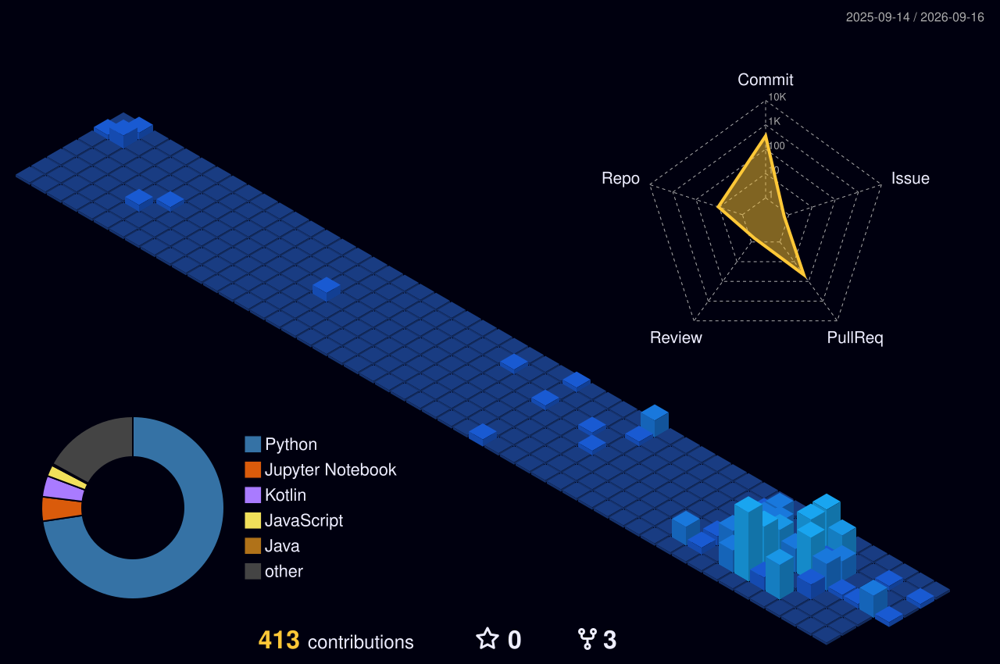

  

## About Me

  
  

    🔭 현재 AI NLP 부트캠프에서 <b>헤지펀드용 멀티 에이전트</b>를 개발하고 있습니다. 
    💬 궁금한 점이 있으시다면 언제든 편하게 질문해 주세요! 
    📫 Contact: <b>dohy3141@naver.com</b>
  

  

      
  

  
---

## Tech Stacks / Skills
  
**Languages :**

**AI / ML / NLP :**

**Backend & API :**

**Frontend & App :**

**Database & Storage :**

**Tools & Infra :**

---

## Competition
500512 NLP InClass Competition (Jul 9, 2026) — 🥈 [2nd / 68](https://www.kaggle.com/competitions/500512-NLP-InClassCompetition/leaderboard) - Public 1st

---

## Contribution Graph
<!-- 3D Contribution Graph -->

  

  

